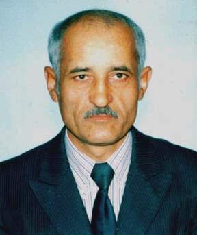

# О словаре

Русско-Эсперантский словарь Фирдауса Шукурова в формате XDXF (подробнее читайте [статью](https://ru.wikipedia.org/wiki/XDXF) на Википедии, [репозиторий проекта](https://github.com/soshial/xdxf_makedict)). Содержит 3104 словарных статей (учитывая синонимы — 4308 слов).

# Руководство по использованию словаря для GoldenDict

1. Скачайте словарь, нажав на зеленую кнопку **Code** (справа вверху), затем выбрав **Download ZIP**.

2. Внутри архива будет 1 папка с файлами словаря, распакуйте её, куда хотите.

3. В GoldenDict нажмите на клавиатуре `F3`, или выберите меню **Правка**, затем **Словари**.

4. На вкладке **Источники** на подвкладке **Файлы** должен быть задан путь до *каталога*, где находится *каталог* с файлами словаря. Если его нет, создайте новый.

5. Нажмите кнопку "**Пересканировать**" внизу справа.

6. На вкладке **Словари** должен появиться новый пункт, "Русско-Эсперантский словарь Ф. Шукурова".

7. Убедитесь, что кнопка словаря на панели инструментов (под главным меню) активна.

# Об авторе

Шукуров Фирдаус родился 17 декабря 1947 года (к сожалению, на момент вёрстки словаря в формат XDXF Фирдаус Шукуров умер.). Окончив школу, он поступил на механико-математический факультет университета в Душанбе, это был первый набор на вновь созданный факультет. Закончив университет, он работал программистом сначала в Математическом институте г. Душанбе, а затем был приглашён в Москву на ВЦ Академии Наук СССР, как лучший программист Таджикистана, где проработал год.

В настоящее время работает преподавателем в университете. Фирдаус вносит огромный вклад в дело пропаганды языка эсперанто. Он занимается этим языком очень давно, постоянно ведёт курсы языка в Клубе эсперантистов своего города, имеет многочисленных учеников. Принимал участие в издании многих пособий, словарей и учебников по эсперанто. Фирдаус участвовал в выпуске электронного журнала "Esperanto новости". Он настоящий энтузиаст этого дела.

Фирдаус прекрасно владеет русским, таджикским, немецким, английским и эсперанто. Причём владеет не только разговорным русским, как многие его соотечественники, но и очень грамотно пишет по-русски. Он утверждает, что язык эсперанто очень легко изучить. Кроме того, знание языка эсперанто очень помогает в изучении других языков, таких как: английский, немецкий, французский, испанский и итальянский.

*Наталия Макарова (двоюродная сестра). Саратов.*
